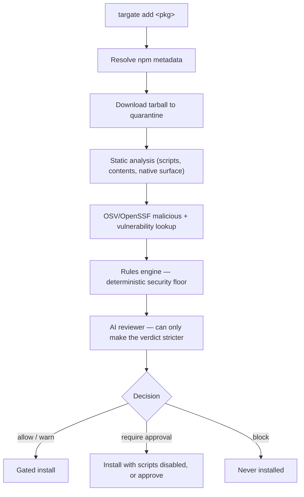

# targate — gate every dependency before it runs

**targate is an AI-assisted dependency intelligence and decision layer for developers, teams, and coding agents.** Its **first application** — the one shipped today — is **pre-install security**: it analyzes an npm package **before** it touches your machine (metadata, lifecycle scripts, tarball contents, React Native native surface, and known malicious-package records), produces an allow / warn / approve / block decision, and only runs the real install if the package passes. Pre-install security is the first application, not the whole category — see [what's shipped today vs. the vision](#whats-shipped-today-vs-the-vision).

Installing a package runs its lifecycle scripts on your machine. `targate` gates that moment. New to the problem it solves? Start with [Why targate](docs/why.md).

## Quick start

Install the CLI, then gate any package before it lands in your project:

```bash
npm install -g targate      # or run ad-hoc: npx targate add <package>
targate add lodash
```

`targate` analyzes the package first and only runs the real install if it passes:

```text
Pre-install review — lodash@4.18.1
────────────────────────────────────────────────────────────
Lodash modular utilities.
license: MIT  ·  published: 5190 days ago  ·  deps: 0  ·  repo: git+https://github.com/lodash/lodash.git

Analysis
  ✓ no lifecycle scripts
  ✓ no known malicious-package records (OSV/OpenSSF)
  ✓ no typosquatting suspicion
  ✓ repository metadata present
  ✓ no native code

Decision: ALLOW   (risk: low, source: rules)
```

Preview a package without installing anything with `--dry-run`, or record a committable approval without installing via `targate approve <package>`. A full positive-and-negative walkthrough — including a package that gets **blocked** — is in [docs/examples/full-review.md](docs/examples/full-review.md).

## How it works

```
developer intent → package inspection → AI risk reasoning → safe install decision
```



targate resolves the package from npm, extracts the tarball into quarantine (scripts never run), statically inspects lifecycle scripts and contents, checks OSV/OpenSSF for malicious records, maps the React Native native surface, then reasons over every signal — with an AI provider if one is configured, or a deterministic rules engine otherwise. **Every deterministic verdict is a floor the AI can never downgrade.** Full walkthrough: [how it works](docs/how-it-works.md) · [architecture](docs/architecture.md).

## Commands at a glance

<!-- targate:commands:start -->
| Command | What it does |
|---|---|
| `targate add <package>[@version]` | Analyze one package, then gate its installation. |
| `targate approve <package>[@version]` | Record a committable human approval without installing. |
| `targate install` | Vet the complete dependency tree, then gate a full install. |
| `targate sandbox <package>[@version]` | Trial-install a package in a disposable Docker container. |
| `targate ci [init]` | Gate dependency changes against a Git ref or scaffold CI. |
| `targate policy init` | Scaffold a declarative team policy from a preset. |
| `targate doctor` | Diagnose the local security and provider environment. |
| `targate diff <pkg>@<v1> [<pkg>[@<v2>]]` | Compare package versions and rate the upgrade risk. |
| `targate monitor` | Re-check trusted packages and report increased risk. |
| `targate graph [<package>[@version]]` | Render a dependency risk graph or explain why a package is present. |
| `targate recommend "<need>"` | Recommend analyzed packages for a need, safest first. |
| `targate history [<package>[@version]]` | Show recorded trust decisions and optionally verify signatures. |
| `targate explain <package>[@version] \| --last` | Explain a fresh or previously recorded decision without installing. |
| `targate cache <info\|clear>` | Inspect or clear the AI assessment cache. |
| `targate agents init` | Scaffold instructions that make coding agents use targate. |
<!-- targate:commands:end -->

Package installation is intentionally explicit: use `targate add <package>`. Bare package names and unknown commands fail without starting an analysis. Run `targate <command> --help` for the options accepted by that command.

Exit codes: `0` ok · `1` error · `2` blocked (or suspicious sandbox / failed CI check). Full flags and options: [docs/cli-reference.md](docs/cli-reference.md).

## Key guarantees

- **Deterministic security floor.** The rules engine decides first; the AI can only make a verdict *stricter*. A jailbroken or prompt-injected model cannot turn `allow_with_warnings`, `require_approval`, or `block` into a weaker result. See [docs/decisions.md](docs/decisions.md).
- **Hard vs soft blocks.** Artifact-identity mismatches, known-malicious records, and remote-code-execution blocks can never be overridden; heuristic ("soft") blocks can be deliberately cleared by a committed approval or allow-list entry.
- **Auditable, verifiable trust.** Every approval records its circumstances (who, when, verdict, tool version, AI model, policy hash) — `targate history` shows it; `targate approve --sign` adds an SSH signature that `requireSignedApprovals` enforces in CI, so a hand-edited approvals file cannot green a poisoned dependency.
- **Nothing untrusted executes during analysis.** Tarballs are SHA-512 identified and checked against every available registry, lockfile, public-mirror, and historical digest before being read in a resource-bounded quarantine — lifecycle scripts never run. A compromised npm mirror that rewrites tarball and metadata is hard-blocked by the independent public comparison. Repository `.ts`/`.js` config is disabled by default; migration-only execution requires `TARGATE_ALLOW_EXEC_CONFIG=1` and emits a warning. See [docs/security.md](docs/security.md).
- **Bounded inputs fail visibly.** Network bodies, tarballs, extracted trees, individual files, and scan time have configurable limits. A timeout or exceeded limit is reported as `UNKNOWN` and deterministically requires approval; it is never presented as clean.
- **Local-AI capable — your code never leaves your machine.** targate does reach the network for package metadata, tarballs and vulnerability data, but the AI reasoning can run entirely on a local model; with no AI provider configured it runs on the deterministic rules engine alone and sends nothing to any model. See [AI providers](docs/ai-providers.md).
- **Fail-closed option.** `--fail-on-osv-error` escalates when the malicious-package lookup can't complete, so a package is never silently trusted while the strongest check was skipped.

## What's shipped today vs. the vision

targate is a dependency **intelligence and decision** layer. Pre-install security is the first application built on that layer, not the whole of it. To keep messaging honest, here is the line between what ships today and where the product is going.

**Available today** — everything in this README is implemented and tested:

- Security score and structured, machine-readable signals (`--json`).
- Reputation and maintainer intelligence.
- Explain, diff, and monitor workflows.
- Team policy, version-specific approvals, and signed trust history.
- Pre-install gating, CI integration, coding-agent integration, and sandboxed observation.

**Future vision** — directional, not commitments (tracked in [what's next](docs/whats-next.md)):

- Developer intent and project context as first-class inputs.
- Grounded dependency recommendations and safer-alternative discovery.
- Deeper trust history across an organization.

The distinction that matters: today targate *inspects and decides*; the vision is that it also *recommends with intent*. An unchecked roadmap item is a plan, not a promise.

## Documentation

Full specifications live in [`docs/`](docs/README.md):

| Topic | Page |
|---|---|
| Why gate dependencies | [why.md](docs/why.md) |
| Full end-to-end example (allow + block) | [examples/full-review.md](docs/examples/full-review.md) |
| Architecture · deterministic vs AI | [architecture.md](docs/architecture.md) |
| The analysis pipeline | [how-it-works.md](docs/how-it-works.md) |
| Every command, flag, exit code | [cli-reference.md](docs/cli-reference.md) |
| Decision policy · hard vs soft blocks | [decisions.md](docs/decisions.md) |
| Policy reference (full schema) | [policy-reference.md](docs/policy-reference.md) |
| AI providers · reasoning support | [ai-providers.md](docs/ai-providers.md) |
| AI response cache | [ai-cache.md](docs/ai-cache.md) |
| `--deep` & `targate install` | [transitive-and-install.md](docs/transitive-and-install.md) |
| Approvals · pnpm builds · team policy | [team-workflow.md](docs/team-workflow.md) |
| Private registries · `.npmrc` · internal scopes | [private-registries.md](docs/private-registries.md) |
| Dependency risk graph · workspaces · CI artifacts | [dependency-graph.md](docs/dependency-graph.md) |
| React Native hardening | [react-native.md](docs/react-native.md) |
| Sandboxed trial install | [sandbox.md](docs/sandbox.md) |
| CI integration | [ci.md](docs/ci.md) |
| AI coding agents | [agents.md](docs/agents.md) |
| Threat model (what it catches / can't) | [threat-model.md](docs/threat-model.md) |
| Security model, scope & limitations | [security.md](docs/security.md) |
| Roadmap · what's next | [whats-next.md](docs/whats-next.md) |

## Development

```bash
pnpm install
pnpm build
pnpm dev add <pkg>   # run from source (tsx), e.g. pnpm dev add react-native-mmkv --dry-run
pnpm test            # vitest suite, including end-to-end CI and full-install fixture checks
pnpm typecheck
pnpm format:check    # zero-dependency whitespace/formatting gate across the tree
pnpm docs:check      # generated CLI docs, examples, and local links
pnpm audit           # runtime dependency advisory audit (--prod, high and above)
pnpm benchmark       # repeatable cold/warm 10–1000 package performance targets
```

Or link the built binary for local use: `pnpm link --global` → `targate add <package>`.

### Continuous integration

[`.github/workflows/ci.yml`](.github/workflows/ci.yml) runs every push and pull request:

- **quality** — `install --frozen-lockfile`, build, typecheck, `format:check`, `docs:check`, and the full test suite, on **Node 22 and 24** across **Linux and Windows** (the Windows leg is the cross-platform path coverage).
- **dependency gate + audit** — gates the project's own dependency tree through `targate install --dry-run` (targate eats its own dog food) and audits runtime dependencies for advisories.
- **performance benchmarks** — the repeatable 10–1000 package targets, which fail the job on regression.

The project deliberately uses no external linter or formatter: type safety is enforced by `tsc` in `strict` mode and formatting by the zero-dependency `format:check`, so no toolchain dependency bypasses the targate gate.
