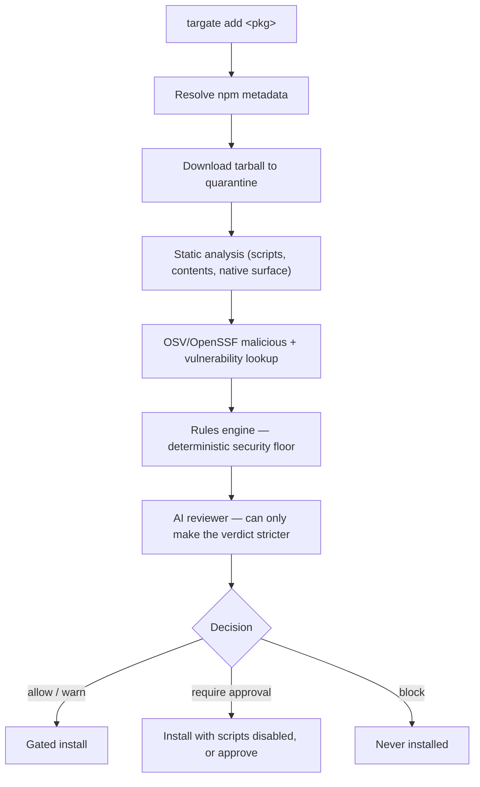

# targate — gate every dependency before it runs

`targate` is a CLI that gates JavaScript and React Native dependencies before they are installed or approved. It analyzes an npm package **before** it touches your machine — metadata, lifecycle scripts, tarball contents, React Native native surface, and known malicious-package records — then produces an allow / warn / approve / block decision and only runs the real install if the package passes.

Installing a package runs its lifecycle scripts on your machine. `targate` gates that moment. New to the problem it solves? Start with [Why targate](docs/why.md).

## Quick start

Install the CLI, then gate any package before it lands in your project:

```bash
npm install -g targate      # or run ad-hoc: npx targate add <package>
targate add lodash
```

`targate` analyzes the package first and only runs the real install if it passes:

```text
Pre-install review — lodash@4.18.1
────────────────────────────────────────────────────────────
Lodash modular utilities.
license: MIT  ·  published: 5190 days ago  ·  deps: 0  ·  repo: git+https://github.com/lodash/lodash.git

Analysis
  ✓ no lifecycle scripts
  ✓ no known malicious-package records (OSV/OpenSSF)
  ✓ no typosquatting suspicion
  ✓ repository metadata present
  ✓ no native code

Decision: ALLOW   (risk: low, source: rules)
```

Preview a package without installing anything with `--dry-run`, or record a committable approval without installing via `targate approve <package>`. A full positive-and-negative walkthrough — including a package that gets **blocked** — is in [docs/examples/full-review.md](docs/examples/full-review.md).

## How it works

```
developer intent → package inspection → AI risk reasoning → safe install decision
```



targate resolves the package from npm, extracts the tarball into quarantine (scripts never run), statically inspects lifecycle scripts and contents, checks OSV/OpenSSF for malicious records, maps the React Native native surface, then reasons over every signal — with an AI provider if one is configured, or a deterministic rules engine otherwise. **Every deterministic BLOCK is a hard floor the AI can never downgrade.** Full walkthrough: [how it works](docs/how-it-works.md) · [architecture](docs/architecture.md).

## Commands at a glance

| Command | What it does |
|---|---|
| `targate add <pkg>` | Analyze one package, then gate the install (`--deep` for its whole tree) |
| `targate approve <pkg>` | Record a committable approval **without** installing |
| `targate install` | Vet the **entire** dependency tree, then gate a full install |
| `targate sandbox <pkg>` | Trial-install in a disposable Docker container, observing its network activity |
| `targate ci` | Analyze the dependencies a PR adds/updates; fail the build on a bad one |
| `targate diff <pkg>@a <pkg>@b` | Show what changed between two versions and rate the upgrade risk |
| `targate monitor` | Re-check approved/installed packages against a baseline; flag risk that rose over time |
| `targate history [<pkg>]` | Trust history: who approved what, when, under which policy/AI — `--verify` checks signatures |
| `targate recommend "<need>"` | Suggest packages for a need (npm search + AI-proposed names), safest first — scored, ranked, with reasons |
| `targate graph [<pkg>]` | The dependency tree as an interactive risk graph (HTML/SVG/dot/mermaid); `--why <pkg>` explains how a package got in |
| `targate explain <pkg>` | Explain why a package would be allowed or blocked (`--last` re-explains the previous run) |
| `targate doctor` | Check the environment: Node, registry, OSV, AI provider, GitHub, policy, cache dirs |
| `targate policy init` | Scaffold the team policy file (`--preset strict`, `react-native`, `ci`, `ai-agent`) |
| `targate agents init` | Scaffold instruction files so AI coding agents gate installs through targate |

Exit codes: `0` ok · `1` error · `2` blocked (or suspicious sandbox / failed CI check). Full flags and options: [docs/cli-reference.md](docs/cli-reference.md).

## Key guarantees

- **Deterministic security floor.** The rules engine decides first; the AI can only make a verdict *stricter*. A jailbroken or prompt-injected model cannot turn a rules-engine BLOCK into an allow. See [docs/decisions.md](docs/decisions.md).
- **Hard vs soft blocks.** Known-malicious and remote-code-execution blocks can never be overridden; heuristic ("soft") blocks can be deliberately cleared by a committed approval or allow-list entry.
- **Auditable, verifiable trust.** Every approval records its circumstances (who, when, verdict, tool version, AI model, policy hash) — `targate history` shows it; `targate approve --sign` adds an SSH signature that `requireSignedApprovals` enforces in CI, so a hand-edited approvals file cannot green a poisoned dependency.
- **Nothing untrusted executes during analysis.** Tarballs are checksum-verified against the registry manifest, extracted into quarantine with strict path checking, and only ever *read* — lifecycle scripts never run. (One caveat: `.ts`/`.js` **config** files do execute; set `TARGATE_NO_EXEC_CONFIG=1` in repos you don't trust — see [docs/security.md](docs/security.md).)
- **Local-AI capable — your code never leaves your machine.** targate does reach the network for package metadata, tarballs and vulnerability data, but the AI reasoning can run entirely on a local model; with no AI provider configured it runs on the deterministic rules engine alone and sends nothing to any model. See [AI providers](docs/ai-providers.md).
- **Fail-closed option.** `--fail-on-osv-error` escalates when the malicious-package lookup can't complete, so a package is never silently trusted while the strongest check was skipped.

## Documentation

Full specifications live in [`docs/`](docs/README.md):

| Topic | Page |
|---|---|
| Why gate dependencies | [why.md](docs/why.md) |
| Full end-to-end example (allow + block) | [examples/full-review.md](docs/examples/full-review.md) |
| Architecture · deterministic vs AI | [architecture.md](docs/architecture.md) |
| The analysis pipeline | [how-it-works.md](docs/how-it-works.md) |
| Every command, flag, exit code | [cli-reference.md](docs/cli-reference.md) |
| Decision policy · hard vs soft blocks | [decisions.md](docs/decisions.md) |
| Policy reference (full schema) | [policy-reference.md](docs/policy-reference.md) |
| AI providers · reasoning support | [ai-providers.md](docs/ai-providers.md) |
| AI response cache | [ai-cache.md](docs/ai-cache.md) |
| `--deep` & `targate install` | [transitive-and-install.md](docs/transitive-and-install.md) |
| Approvals · pnpm builds · team policy | [team-workflow.md](docs/team-workflow.md) |
| Private registries · `.npmrc` · internal scopes | [private-registries.md](docs/private-registries.md) |
| Dependency risk graph · workspaces · CI artifacts | [dependency-graph.md](docs/dependency-graph.md) |
| React Native hardening | [react-native.md](docs/react-native.md) |
| Sandboxed trial install | [sandbox.md](docs/sandbox.md) |
| CI integration | [ci.md](docs/ci.md) |
| AI coding agents | [agents.md](docs/agents.md) |
| Threat model (what it catches / can't) | [threat-model.md](docs/threat-model.md) |
| Security model, scope & limitations | [security.md](docs/security.md) |
| Roadmap · what's next | [whats-next.md](docs/whats-next.md) |

## Development

```bash
pnpm install
pnpm build
pnpm dev add <pkg>   # run from source (tsx), e.g. pnpm dev add react-native-mmkv --dry-run
pnpm test            # vitest suite (537 tests, incl. end-to-end CI and full-install checks on fixture repos)
pnpm typecheck
```

Or link the built binary for local use: `pnpm link --global` → `targate add <package>`.
