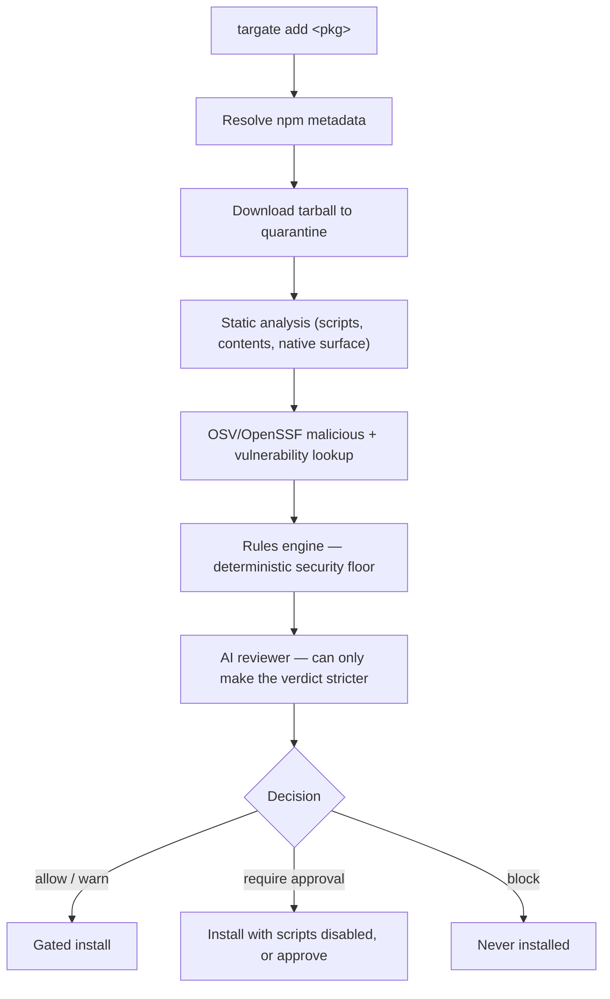

# targate — install-time supply-chain security for npm, in your terminal

[](https://www.npmjs.com/package/targate)
[](https://github.com/marcoabate-ck/targate/actions/workflows/ci.yml)
[](https://targate.dev)
[](LICENSE)
[](package.json)

**targate is install-time supply-chain security for npm — open source, AI-optional, and run from your terminal.** It vets every dependency **before** its code can run: it fetches the published tarball into an isolated quarantine (lifecycle scripts never execute), reads the install-time scripts, analyzes the resolved lockfile before anything is downloaded for real, checks reputation and known-malicious records, and returns an allow / warn / approve / block decision — then runs the real install only if the package passes.

Four things define it:

- **Install-time.** The gate sits at the exact moment `npm install` would otherwise run a package's lifecycle scripts on your machine — _before_ code executes, not after.
- **Supply-chain, not application security.** It reasons about what a third-party dependency _does when you install it_, not about bugs in the code you write. See [supply chain vs. application security](docs/why.md#supply-chain-security-not-application-security).
- **AI-optional.** A deterministic rules engine decides on its own; an AI reviewer, when configured, can only make a verdict _stricter_ and can run on a local model. With no provider, nothing leaves your machine.
- **Terminal-native & open source.** One CLI in the workflow and CI you already have — no dashboard, no account, no SaaS. New to the problem it solves? Start with [Why targate](docs/why.md).

## Quick start

Install the CLI, then gate any package before it lands in your project:

```bash
npm install -g targate      # or run ad-hoc: npx targate add <package>
targate add lodash
```

`targate` analyzes the package first and only runs the real install if it passes:

```text
Pre-install review — lodash@4.17.21
────────────────────────────────────────────────────────────
Lodash modular utilities.
license: MIT  ·  published: 1977 days ago  ·  deps: 0  ·  repo: git+https://github.com/lodash/lodash.git

Analysis
  ✓ no lifecycle scripts
  ✓ no known malicious-package records (OSV/OpenSSF)
  ✓ no typosquatting suspicion
  ✓ repository metadata present
  ✓ OSV/OpenSSF lookup completed
  ✓ no native code
  static findings:
    - lodash.min.js: appears minified/obfuscated

Decision: ALLOW   (risk: low, source: rules)
```

Preview a package without installing anything with `--dry-run`, or record a committable approval without installing via `targate approve <package>`. A full positive-and-negative walkthrough — including a package that gets **blocked** — is in [docs/examples/full-review.md](docs/examples/full-review.md).

> **Tip — vet the whole tree.** By default `targate add <pkg>` analyzes only the package you named; a malicious dependency usually hides deeper in the tree. **Strongly recommended:** add `--deep` (or use `targate install`) before pulling a dependency into a real project or in CI — it runs the same analysis over every transitive dependency. It is opt-in rather than default because a deep run resolves and analyzes the entire tree (more network/AI cost); the quick per-package check stays fast by default. See [transitive dependencies & full-tree install](docs/transitive-and-install.md).

## Install

`targate` ships three ways — all install the same CLI.

> **Note:** only the **npm** method works today. The install script and the direct binary downloads go live with the **first tagged release** — until then their commands below are shown for reference and will 404.

**npm** — every platform, needs Node ≥ 22.13:

```bash
npm install -g targate      # or ad-hoc: npx targate add <package>
```

**Install script** — macOS & Linux; detects your OS/arch, downloads the binary, and **verifies a minisign signature over the checksums and then the SHA-256** before installing. It fails closed: no `minisign`, a missing signature, or a bad signature aborts the install (needs [`minisign`](https://jedisct1.github.io/minisign/) on `PATH`):

```bash
curl -fsSL https://raw.githubusercontent.com/marcoabate-ck/targate/main/install.sh | sh
```

**Direct download** — grab a standalone binary from the [latest release](https://github.com/marcoabate-ck/targate/releases/latest) and verify it against the release `SHA256SUMS`:

| Platform    | Asset                     |
| ----------- | ------------------------- |
| macOS arm64 | `targate-darwin-arm64`    |
| macOS x64   | `targate-darwin-x64`      |
| Linux arm64 | `targate-linux-arm64`     |
| Linux x64   | `targate-linux-x64`       |
| Windows x64 | `targate-windows-x64.exe` |

```bash
# verify then install (example: macOS arm64)
grep targate-darwin-arm64 SHA256SUMS | shasum -a 256 -c -
install -m 0755 targate-darwin-arm64 /usr/local/bin/targate
```

The standalone binaries bundle the JS runtime, but `targate` still calls your `git` and package manager at runtime — keep those installed.

## How it works

```
developer intent → package inspection → AI risk reasoning → safe install decision
```



targate resolves the package from npm, extracts the tarball into quarantine (scripts never run), statically inspects lifecycle scripts and contents, checks OSV/OpenSSF for malicious records, maps the React Native native surface, then reasons over every signal — with an AI provider if one is configured, or a deterministic rules engine otherwise. **Every deterministic verdict is a floor the AI can never downgrade.** Full walkthrough: [how it works](docs/how-it-works.md) · [architecture](docs/architecture.md).

## Commands at a glance

<!-- targate:commands:start -->
| Command | What it does |
|---|---|
| `targate add <package>[@version]` | Analyze one package, then gate its installation. |
| `targate approve <package>[@version]` | Record a committable human approval without installing. |
| `targate audit <package>[@version]` | AI-read a package's source for security issues, without installing. |
| `targate install` | Vet the complete dependency tree, then gate a full install. |
| `targate sandbox <package>[@version]` | Trial-install a package in a disposable Docker container. |
| `targate ci [init]` | Gate dependency changes against a Git ref or scaffold CI. |
| `targate policy init` | Scaffold a declarative team policy from a preset. |
| `targate doctor` | Diagnose the local security and provider environment. |
| `targate diff <pkg>@<v1> [<pkg>[@<v2>]]` | Compare package versions and rate the upgrade risk. |
| `targate monitor` | Re-check trusted packages and report increased risk. |
| `targate graph [<package>[@version]]` | Render a dependency risk graph or explain why a package is present. |
| `targate recommend "<need>"` | Recommend analyzed packages for a need, safest first. |
| `targate history [<package>[@version]]` | Show recorded trust decisions and optionally verify signatures. |
| `targate explain <package>[@version] \| --last` | Explain a fresh or previously recorded decision without installing. |
| `targate cache <info\|clear>` | Inspect or clear the AI assessment cache. |
| `targate agents init` | Scaffold instructions that make coding agents use targate. |
<!-- targate:commands:end -->

Package installation is intentionally explicit: use `targate add <package>`. Bare package names and unknown commands fail without starting an analysis. Run `targate <command> --help` for the options accepted by that command.

Exit codes: `0` ok · `1` error · `2` blocked (or suspicious sandbox / failed CI check). Full flags and options: [docs/cli-reference.md](docs/cli-reference.md).

## Key guarantees

- **Deterministic security floor.** The rules engine decides first; the AI can only make a verdict _stricter_. A jailbroken or prompt-injected model cannot turn `allow_with_warnings`, `require_approval`, or `block` into a weaker result. See [docs/decisions.md](docs/decisions.md).
- **Hard vs soft blocks.** Artifact-identity mismatches, known-malicious records, and remote-code-execution blocks can never be overridden; heuristic ("soft") blocks can be deliberately cleared by a committed approval or allow-list entry.
- **Auditable, verifiable trust.** Every approval records its circumstances (who, when, verdict, tool version, AI model, policy hash) — `targate history` shows it; `targate approve --sign` adds an SSH signature that `requireSignedApprovals` enforces in CI, so a hand-edited approvals file cannot green a poisoned dependency.
- **Nothing untrusted executes during analysis.** Tarballs are SHA-512 identified and checked against every available registry, lockfile, public-mirror, and historical digest before being read in a resource-bounded quarantine — lifecycle scripts never run. A compromised npm mirror that rewrites tarball and metadata is hard-blocked by the independent public comparison **when a public mirror is configured** (`registries[].mirrorOf` or a global `.npmrc` override) **and reachable**; against the default `registry.npmjs.org`, or when the public comparison is unavailable, the divergence is surfaced for review (`require_approval` / `allow_with_warnings`) rather than hard-blocked. Repository configuration is **declarative only** (`.yaml`/`.yml`/`.json`) — it is parsed, never executed, so a hostile repo cannot run code through a config file. See [docs/security.md](docs/security.md).
- **Bounded inputs fail visibly.** Network bodies, tarballs, extracted trees, individual files, and scan time have configurable limits. A timeout or exceeded limit is reported as `UNKNOWN` and deterministically requires approval; it is never presented as clean.
- **Local-AI capable — your code never leaves your machine.** targate does reach the network for package metadata, tarballs and vulnerability data, but the AI reasoning can run entirely on a local model; with no AI provider configured it runs on the deterministic rules engine alone and sends nothing to any model. See [AI providers](docs/ai-providers.md).
- **Fail-closed option.** `--fail-on-osv-error` escalates when the malicious-package lookup can't complete, so a package is never silently trusted while the strongest check was skipped.

## What's shipped today vs. the vision

Install-time supply-chain security is what targate _is_ today. Under the hood it is a dependency **intelligence and decision** layer, and that engine can grow beyond the install gate. To keep messaging honest, here is the line between what ships today and where the product is going.

**Available today** — everything in this README is implemented and tested:

- Security score and structured, machine-readable signals (`--json`).
- Reputation and maintainer intelligence.
- Explain, diff, and monitor workflows.
- Team policy, version-specific approvals, and signed trust history.
- Pre-install gating, CI integration, coding-agent integration, and sandboxed observation.

**Future vision** — directional, not commitments (tracked in [what's next](docs/whats-next.md)):

- Developer intent and project context as first-class inputs.
- Grounded dependency recommendations and safer-alternative discovery.
- Deeper trust history across an organization.

The distinction that matters: today targate _inspects and decides_; the vision is that it also _recommends with intent_. An unchecked roadmap item is a plan, not a promise.

## Documentation

The full docs are online at **[targate.dev/docs](https://targate.dev/docs/)**. The same specifications live in [`docs/`](docs/README.md):

| Topic                                             | Page                                                        |
| ------------------------------------------------- | ----------------------------------------------------------- |
| Why gate dependencies                             | [why.md](docs/why.md)                                       |
| Full end-to-end example (allow + block)           | [examples/full-review.md](docs/examples/full-review.md)     |
| Architecture · deterministic vs AI                | [architecture.md](docs/architecture.md)                     |
| The analysis pipeline                             | [how-it-works.md](docs/how-it-works.md)                     |
| Every command, flag, exit code                    | [cli-reference.md](docs/cli-reference.md)                   |
| Decision policy · hard vs soft blocks             | [decisions.md](docs/decisions.md)                           |
| Policy reference (full schema)                    | [policy-reference.md](docs/policy-reference.md)             |
| AI providers · reasoning support                  | [ai-providers.md](docs/ai-providers.md)                     |
| AI response cache                                 | [ai-cache.md](docs/ai-cache.md)                             |
| `--deep` & `targate install`                      | [transitive-and-install.md](docs/transitive-and-install.md) |
| Approvals · pnpm builds · team policy             | [team-workflow.md](docs/team-workflow.md)                   |
| Private registries · `.npmrc` · internal scopes   | [private-registries.md](docs/private-registries.md)         |
| Dependency risk graph · workspaces · CI artifacts | [dependency-graph.md](docs/dependency-graph.md)             |
| React Native hardening                            | [react-native.md](docs/react-native.md)                     |
| Sandboxed trial install                           | [sandbox.md](docs/sandbox.md)                               |
| CI integration                                    | [ci.md](docs/ci.md)                                         |
| AI coding agents                                  | [agents.md](docs/agents.md)                                 |
| Threat model (what it catches / can't)            | [threat-model.md](docs/threat-model.md)                     |
| Security model, scope & limitations               | [security.md](docs/security.md)                             |
| Roadmap · what's next                             | [whats-next.md](docs/whats-next.md)                         |

## Development

```bash
pnpm install
pnpm build
pnpm dev add <pkg>   # run from source (tsx), e.g. pnpm dev add react-native-mmkv --dry-run
pnpm test            # vitest suite, including end-to-end CI and full-install fixture checks
pnpm typecheck
pnpm format:check    # zero-dependency whitespace/formatting gate across the tree
pnpm docs:check      # generated CLI docs, examples, and local links
pnpm pack:check      # offline: the published tarball ships only dist/**+README+LICENSE+package.json, and the bin runs
pnpm audit           # runtime dependency advisory audit (--prod, high and above)
pnpm benchmark       # repeatable cold/warm 10–1000 package performance targets
```

Or use the built CLI locally: run it in place with `node dist/cli.js add <package>`, or register it as `targate` on your PATH — `pnpm setup` once (creates pnpm's global bin dir), then `pnpm add -g .` from the repo root (pnpm ≥ 11; on pnpm ≤ 10 use `pnpm link --global`, which pnpm 11 removed).

### Continuous integration

[`.github/workflows/ci.yml`](.github/workflows/ci.yml) runs every push and pull request:

- **quality** — `install --frozen-lockfile`, build, typecheck, `format:check`, `docs:check`, the full test suite, and `pack:check` (the published-artifact gate), on **Node 22 and 24** across **Linux and Windows** (the Windows leg is the cross-platform path coverage).
- **dependency gate + audit** — gates the project's own dependency tree through `targate install --dry-run` (targate eats its own dog food) and audits runtime dependencies for advisories.
- **performance benchmarks** — the repeatable 10–1000 package targets, which fail the job on regression.

The project deliberately uses no external linter or formatter: type safety is enforced by `tsc` in `strict` mode and formatting by the zero-dependency `format:check`, so no toolchain dependency bypasses the targate gate.

## Contributing & security

- Contributions are welcome — read [CONTRIBUTING.md](CONTRIBUTING.md) for the workflow, gates, and expectations, and [CODE_OF_CONDUCT.md](CODE_OF_CONDUCT.md) for community standards.
- Found a security issue? **Do not open a public issue.** Follow the private disclosure process in [SECURITY.md](SECURITY.md).

## Stability & compatibility

`targate` follows [Semantic Versioning](https://semver.org/). From **1.0.0** on,
the following are the stable surface — a breaking change to any of them ships
only in a new **major** version, with an entry in [CHANGELOG.md](CHANGELOG.md):

- **CLI** — command names, their flags, and exit codes. In particular `0` = allowed / clean, `1` = usage or operational error, `2` = blocked (and, for `ci` and `install`, an unresolved approval). Note the `2`-on-unresolved-approval contract applies to the non-interactive `ci`/`install` paths; interactive `targate add` returns `0` when a `require_approval` package is skipped or declined. New commands and new (additive) flags are minor releases. The stable command set is `add`, `approve`, `install`, `ci`, `audit`, `doctor`, `explain`, `diff`, `history`, `policy`, `agents`, and `cache`; `graph`, `recommend`, and `monitor` ship as **experimental** and may change flags or output in a minor release.
- **`--json` output** — the machine-readable schema, carried explicitly as `schemaVersion` (currently `1`). Within a major, changes are **additive only** (consumers must ignore unknown keys); any removal, rename, or type change bumps `schemaVersion` and the major.
- **Committed config formats** — `.targate/approvals.json`, `.targate/denials.json`, and the `targate.policy.*` schema (including the `dependencyPolicy`, `aiCache`, `registries`, and `resourceLimits` fields). Existing keys keep their meaning within a major; unknown keys are ignored with a warning.

Not part of the stable surface (may change in a minor release): human-readable
terminal formatting, heuristic tuning and thresholds, AI prompts/models, the
security **score** number, and internal module APIs (`targate` is consumed as a
CLI, not imported as a library).

Releases are cut by pushing a `v*` tag; the release pipeline
([`.github/workflows/release.yml`](.github/workflows/release.yml)) runs the full
gate set (typecheck, tests, build, docs, format, and the `pack:check` artifact
gate, plus the runtime dependency audit), sets the published version from the
tag, and publishes with npm provenance. The `version` in `package.json` is not
bumped by hand.
