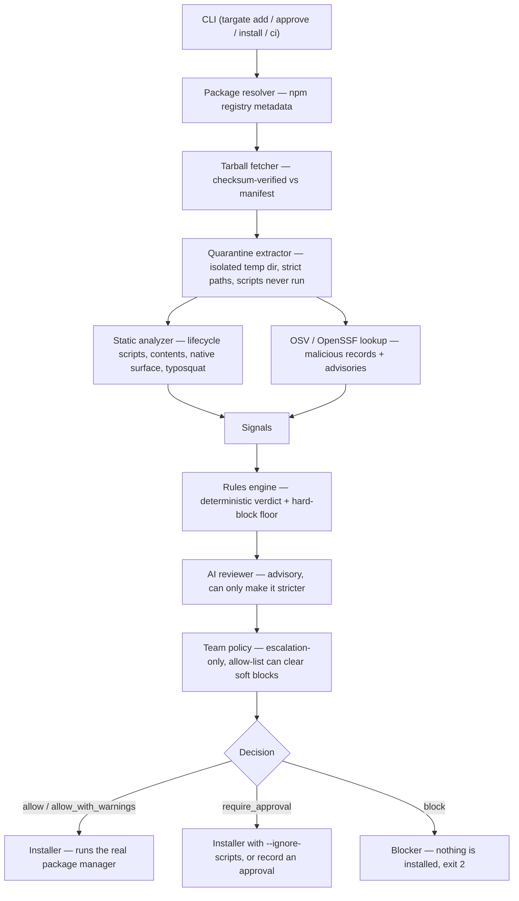

# Architecture

targate is a pipeline. A package name goes in; a gated install decision comes out. Each stage produces **signals** (facts) that flow into a **rules engine** (the deterministic security floor) and then, optionally, an **AI reviewer** (advisory, clamped). The block — or the install — happens at the very end, once.

For the step-by-step behaviour of each stage see [How it works](how-it-works.md); this page is the map and, crucially, the line between **what is deterministic and what is probabilistic**.

## The pipeline

## Stages

| Stage | Responsibility |
|---|---|
| **CLI** | Parses the command (`add`, `approve`, `install`, `sandbox`, `ci`, `policy`, `agents`), flags, and provider selection. |
| **Package resolver** | Fetches registry metadata: version, repository, maintainers, publish dates, scripts, dependencies. |
| **Tarball fetcher** | Downloads the tarball and **verifies its checksum** against the registry manifest (`dist.integrity` SRI, falling back to `dist.shasum`) before anything reads it. A mismatch aborts loudly. |
| **Quarantine extractor** | Extracts into an isolated temp dir with strict path checking. Contents are only ever *read* — lifecycle scripts are never executed. |
| **Static analyzer** | Detects lifecycle scripts and inspects their command strings; scans contents for `process.env` / `child_process` / network / `eval` / obfuscation; maps the React Native native surface; checks for typosquatting. |
| **OSV / OpenSSF lookup** | Queries for known-malicious records (`MAL-*`, GHSA malware) and vulnerability advisories. |
| **Signals** | The structured, machine-readable set of facts every downstream stage consumes (also the shape emitted by `--json`). |
| **Rules engine** | Maps signals to a deterministic verdict and marks any **hard block**. This is the security floor. |
| **AI reviewer** | Optional. Reasons over the same signals for a contextual verdict — strictly advisory and clamped (below). |
| **Team policy** | Applied on top of the assessment; escalation-only, with the one documented exception that an allow-list entry can clear a *soft* block. See [Policy reference](policy-reference.md). |
| **Installer / Blocker** | Runs the real package manager for an allow, `--ignore-scripts` for require-approval, or nothing at all for a block. |

## Deterministic vs. probabilistic

This is the load-bearing design decision. **Security guarantees come from the deterministic half; the AI only ever adds caution.**

### Deterministic (the security floor)

- Checksum verification of the tarball.
- Quarantine extraction — scripts never run, regardless of anything.
- The static signal extraction (scripts, contents, native surface, typosquat distance).
- The OSV/OpenSSF malicious/advisory lookup.
- The **rules engine** verdict and the **hard-block** classification.
- The **clamp**: `clampDecision` re-runs the rules engine and, if it returns BLOCK, forces the final decision to BLOCK regardless of what the model said.
- Team policy escalation.

These run identically with `--no-ai`, with no provider configured, and in CI. The output is reproducible.

### Probabilistic (advisory only)

- The **AI reviewer**'s verdict and prose reasoning.

That's the whole probabilistic surface. It exists to catch *combinations* of signals a flat rule misses ("recent publish **plus** missing repo **plus** a postinstall") and to explain them in words.

## What the AI can and cannot do

**Can:**
- Make a verdict **stricter** — escalate an `allow` to `require_approval` or `block` when the combination of signals looks risky.
- Explain its reasoning in the report (`source: ai`).

**Cannot:**
- **Downgrade a deterministic BLOCK.** A jailbroken, prompt-injected, or simply wrong model cannot turn a rules-engine BLOCK into an allow — the clamp overrides it. See [Decision policy](decisions.md).
- Run any package code (there is no execution stage before the decision).
- Reach a decision when a provider is misconfigured or fails — targate falls back to the rules engine and notes it.

## Where policy applies, and where the block actually happens

- **Policy** is applied at one point — after the AI/rules assessment, before the decision is finalized. It can only make the decision stricter, except that `allowKnownPackages` can clear a **soft** (heuristic) block. A **hard** block (known-malicious record, or a `curl … | bash`-style download-and-execute) is immune to policy, the allow list, approvals, and the AI alike. See [Policy reference](policy-reference.md) and [Hard vs soft blocks](decisions.md#hard-vs-soft-blocks).
- **The block** happens exactly once, at the Installer/Blocker stage. Up to that point nothing untrusted has executed; a `block` verdict simply means the installer is never invoked and the process exits `2`.

## Scope

By default only the requested top-level package flows through this pipeline. `--deep` and `targate install` run the *same* pipeline over the full transitive tree; the strictest verdict in the tree gates the whole install. See [Transitive dependencies & full-tree install](transitive-and-install.md) and the [Security model](security.md#scope-and-limitations).
