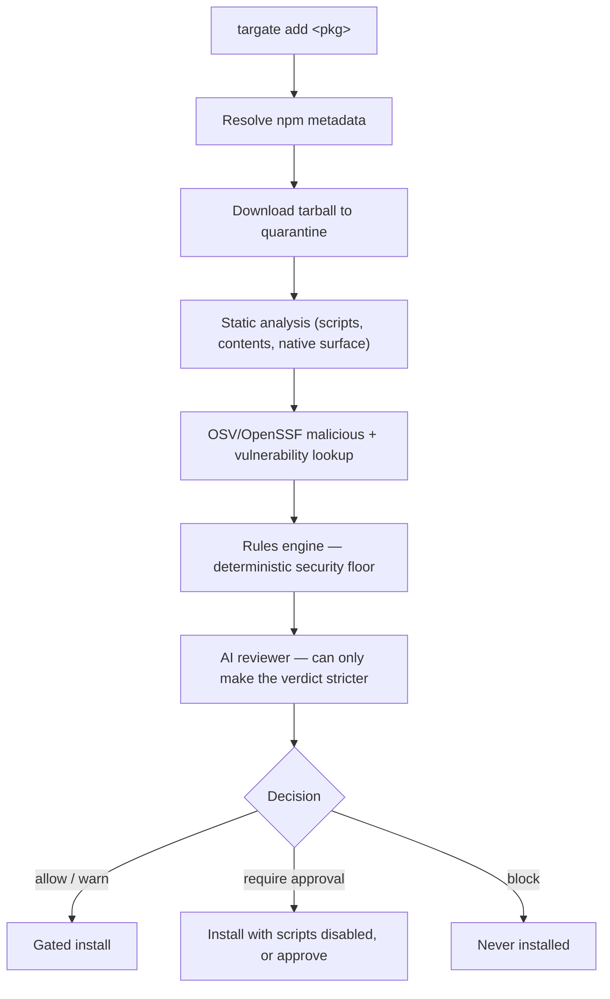

# How it works

Every gate runs the same pipeline. The guiding shape is:

> developer intent → package inspection → risk reasoning → safe install decision

## 1. Resolve metadata

targate fetches the package's registry metadata (the full packument) — version, dependencies, declared lifecycle scripts, repository, maintainers, publish times, and the tarball URL and integrity. Private registries and per-scope `.npmrc` credentials are honored; see **[Scenarios → private registries](./scenarios#private-registries)**.

## 2. Quarantine the tarball

The tarball is downloaded into an isolated temporary directory and **its bytes are verified before anything reads them**. targate computes the SHA-512 digest and compares it against every independent source available: the source registry's declared integrity, your lockfile, the public npm mirror, and any previously recorded digest for that exact version.

- If the bytes match trusted evidence, the artifact is authentic and analysis proceeds.
- If they **differ** from that evidence, the artifact is `mutated` and **hard-blocked** — a compromised mirror that rewrites both tarball and metadata is caught by the independent public comparison.

Extraction happens **without running any lifecycle script**, with strict path handling (no escapes, no symlinks) and bounded file counts, sizes, and total bytes. See **[Decisions & trust](./concepts/decisions-and-trust)** for the trust levels.

## 3. Static analysis

targate inspects the extracted, authentic tarball:

- **Lifecycle scripts** — `preinstall`/`install`/`postinstall` are install-time (they run on a registry install); `prepare`/`prepack` are pack/publish-time and are reported as informational, not install-time risk. Command strings are scanned for suspicious constructs (shell invocation, `curl … | bash`, `node -e`, credential-file references, base64, absolute-path writes).
- **File contents** — install-time code is prioritized and scanned for `process.env` access, child-process spawning, network calls, `eval`/`Function`, and minified/obfuscated payloads.
- **React Native native surface** — iOS/Android directories, `.podspec`, `build.gradle`, `CMakeLists.txt`, prebuilt binaries and frameworks, autolinking config, and dangerous Android permissions. See **[React Native hardening](./concepts/react-native)**.

## 4. OSV / OpenSSF lookup

targate queries OSV/OpenSSF for **known-malicious package records** and known vulnerability advisories. Known-malicious is targate's strongest deterministic signal. If the lookup can't complete, the result is treated as `UNKNOWN` (never "clean"); `--fail-on-osv-error` escalates that to a hard requirement so a package is never silently trusted while the strongest check was skipped.

## 5. Rules engine — the deterministic floor

A deterministic rules engine turns the signals into a verdict:

- **BLOCK** — a mutated artifact, a known-malicious record, or a lifecycle command that downloads *and* executes remote code.
- **REQUIRE_APPROVAL** — install-time lifecycle scripts, suspicious constructs, degraded/unknown analysis, and similar signals a human should clear.
- **ALLOW_WITH_WARNINGS** — native surface, missing repo metadata, advisories, or informational notes.
- **ALLOW** — no high-risk install-time behavior.

This verdict is a **floor**.

## 6. AI reviewer — stricter only

If an AI provider is configured, the model reviews the same signals and can add context. Its decision is **clamped**: it can raise a verdict's severity but can never lower the rules-engine floor. A jailbroken or prompt-injected model cannot turn `require_approval` or `block` into `allow`. With no provider configured, the rules engine's verdict stands alone. See **[AI & privacy](./concepts/ai-and-privacy)**.

## 7. The decision gates the install

- **allow / allow_with_warnings** → the real install runs.
- **require_approval** → install is refused unless a committed approval covers this exact version; interactively, targate offers to install with scripts disabled or to record an approval.
- **block** → never installed. Hard blocks can never be overridden; soft (heuristic) blocks can be deliberately cleared by a committed approval or allow-list entry.

Read on: **[Decisions & trust](./concepts/decisions-and-trust)** · **[Approvals & policy](./concepts/approvals-and-policy)**.
